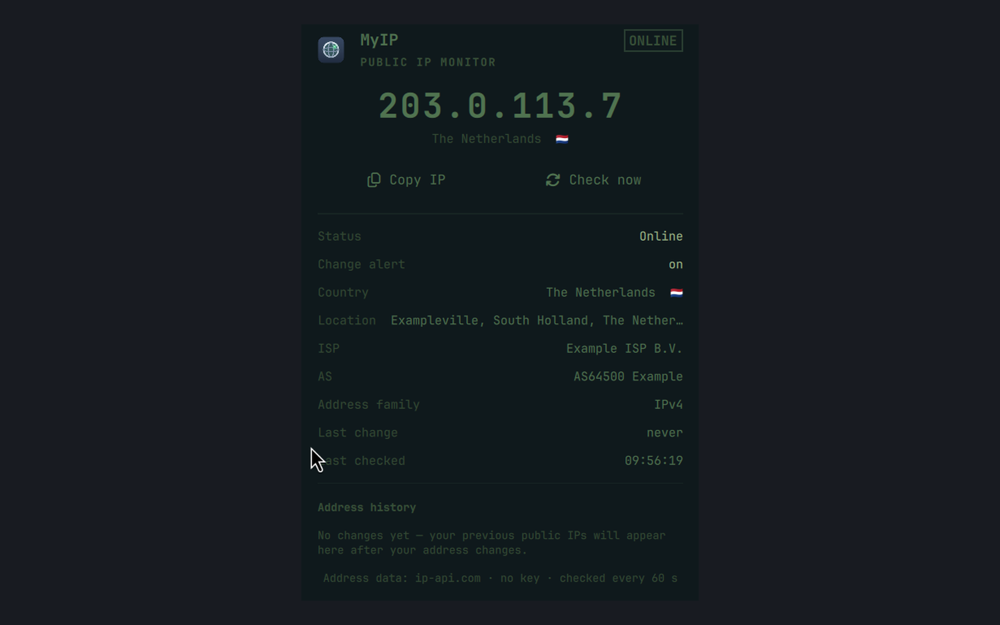

# MyIP

**MyIP** is an Omarchy bar widget that shows your **public IP address with its
country flag** at a glance — so you always see which IP you are reaching the
internet with, straight from the bar.




*Preview — the widget in the bar and its details panel, showing sample data
(an RFC 5737 example address, never a real one).*


## Features

- **Live public IPv4 in the bar**: the widget shows your current public IP with
  its country flag next to a custom MyIP icon, refreshed quietly every 60
  seconds. The widget name stays visible so the bar always reads clearly.
- **Masked by default**: the bar shows only the leading label of the address
  (`198.**.***.**`) so your public IP is not readable over your shoulder, in a
  screenshot, or on a stream. Hover the widget — or open its panel — and the
  full address appears; move away or close the panel and it hides itself
  again. The masked form is exactly as wide as the real one, so nothing in
  the bar shifts when it reveals. Set `maskAddress: false` to opt out.
- **Calm states**: a short *checking…* moment on first start, then either the
  address or a quiet *offline* state (dimmed icon, informative tooltip). A
  single failed check never hides the last known address; the widget only
  reports *offline* after repeated failures, and it never retries faster than
  the poll interval. Tooltips show the address, country/flag, ISP and the
  last-check time in every state.
- **Details panel**: click the widget (left or right) to open a panel with the
  address, country/flag, city/region, ISP and AS, address family, last change,
  last-checked time, a **Copy IP** action (Omarchy clipboard IPC) and a manual
  **Check now**.
- **IP-change detection (VPN-leak alert)**: the widget remembers the last
  public address and sends one quiet Omarchy notification whenever it really
  changes — the classic VPN-leak signal (VPN drops, your IP slips back to your
  home address). The first sighting after a fresh start is a silent baseline:
  a state reset or a restart with an unchanged address never rings.
- **Address history**: the panel keeps a short list of your previous public
  addresses with the time they were replaced (calm empty state before the
  first change).
- **Custom icon**: a calm navy globe tile (128×128) in the visual language of
  the other Omarchy system plugins, shown both in the bar and in the panel.

## Install

```sh
omarchy plugin add https://github.com/Shirak-Semonian/myip-omarchy-plugin --enable --yes
omarchy bar put io.github.shirak-semonian.myip
omarchy restart shell
```

For local development you can copy the folder instead:

```sh
cp -r . ~/.config/omarchy/plugins/io.github.shirak-semonian.myip
omarchy bar put io.github.shirak-semonian.myip
omarchy restart shell
```

## Uninstall

```sh
omarchy plugin remove io.github.shirak-semonian.myip --yes
omarchy restart shell
```

This removes the widget from the bar and the plugin from disk. Two small
user files are **not** removed automatically, because they may hold history
you want to keep — delete them too for a complete clean removal:

```sh
rm -f ~/.config/myip/config.json      # optional settings (if you made any)
rm -rf ~/.local/state/myip            # last known address + change history
```

## How it works

- One heartbeat drives a **single reusable fetch process**: at most one
  request in flight, at most one per poll interval (default 60 s).
- Poll timestamps are floating-point epochs (`Date.now()` is ~1.7e12 ms) —
  never 32-bit integers, which would overflow and cause polling spam.
- After every attempt — success or failure — the next poll is scheduled a
  full interval away, so an offline network never turns into a retry loop.
- The widget shows the **last known address** while a check is in flight or
  after a single failure, so the bar never flickers.
- **Change tracking is local and quiet**: the last known address and a short
  history (max 6 entries) are persisted as JSON in
  `~/.local/state/myip/state.json` (user-only, atomic writes). The first
  successful check after a reset is a *baseline*, never an alert; only a real
  address change emits one notification per transition. Twin bar instances
  (one per monitor) dedupe through a flock gate in
  `~/.local/state/myip/notifications.gate`, so a single change rings once.
- A notification is only ever about an address *change*; there is no periodic
  or startup announce. `alertOnChange: false` in the config silences the
  change popup while the history is still tracked.

## Configuration

MyIP is fully optional and **key-less**: an absent or empty config file means
“run with defaults”. To tune it, create `~/.config/myip/config.json`
(user-only, `chmod 600`):

```json
{
  "pollIntervalSeconds": 60,
  "requestTimeoutSeconds": 8,
  "alertOnChange": true,
  "showCountry": true,
  "showFlag": true,
  "maskAddress": true
}
```

| Key                     | Default | Meaning                                                          |
| ----------------------- | ------- | ---------------------------------------------------------------- |
| `pollIntervalSeconds`   | `60`    | Seconds between public-IP checks (clamped to 30–3600)            |
| `requestTimeoutSeconds` | `8`     | Per-request timeout in seconds (clamped to 3–30)                 |
| `alertOnChange`         | `true`  | Show the IP-change popup when your public address changes        |
| `showCountry`           | `true`  | Show the country name / location in the panel and tooltips       |
| `showFlag`              | `true`  | Show the flag emoji in the bar, panel and notifications          |
| `maskAddress`           | `true`  | Mask the address in the bar until hover / open panel             |

Unknown keys are ignored, so a future version can add settings without
breaking older files. The file is watched live: save an edit and the widget
picks it up within a second — no restart needed.

If the file becomes unreadable or contains invalid JSON, the widget stays
calm, keeps running with defaults and shows a *config file needs attention*
state in the panel with a **Reset to defaults** action (the broken file is
first kept as `config.json.bak-<timestamp>`). Config contents are never shown
in the UI or the journal — only fixed, human-readable problem sentences.

**Copy is fixed, not configurable**: there is no `copyCommand` setting and no
shell interpolation of user input. The Copy action always calls Omarchy's own
clipboard IPC (`omarchy-clipboard-paste-text --copy-only`) with the address as
a plain positional argument.

## Why the address is masked

Your public IP is not a secret, but it is not something that benefits from
sitting permanently on screen either. It is a stable identifier: it geolocates
you to your city and ISP, it links your desktop to any account or log that has
seen the same address, and it is the one piece of information an attacker
needs to aim traffic at your connection.

A status bar is the worst place to leave it. Bars are always visible, so the
address ends up in every screenshot, every screen share, every stream and
every photo of a desk — usually without anyone noticing it was there. Bug
reports are the common case: people screenshot their whole bar to show an
unrelated widget.

Masking removes that whole class of accidental disclosure without costing the
feature. The leading label stays visible, so the widget still answers the
questions it exists for at a glance — did my address change, did my VPN drop
me back onto my ISP's range — while the identifying part is one hover away
when you actually want it. Because the reveal is bound to hover and panel
state rather than a toggle, it cannot be left on by accident.

## Privacy and the address service

MyIP asks one public service, **ip-api.com** (free tier), for its own public
address and coarse geo data:

- One request per poll, **no key, no account**, no monthly cap at this rate
  (free tier: 45 requests/minute; MyIP uses ~1/minute).
- The request is limited to the fields the widget renders (`fields=…` — no
  coordinates are fetched or stored).
- The response is capped at 64 KiB both on the curl command line and before
  JSON parsing.
- The free tier is **HTTP only**; that trade-off is accepted because the
  payload is the public address and coarse country the service learns anyway
  when we ask it for our own IP. No other data is sent.
- The widget's own state file keeps only the public address history needed
  for change detection (see above) and never contains secrets. Only short
  status lines go to the shell journal.
- ip-api.com's self endpoint answers over the requesting IP family; on this
  host that is IPv4, so the panel shows *IPv4*. The model marks the family of
  whatever address the provider returns and the panel displays it — no
  dead toggle is shown for an address family the provider never delivers.

Alternatives were evaluated during development (ipify.org returns only the IP;
ipinfo.io and ipwho.is free tiers carry monthly caps that a 60 s poll would
exhaust) — the choice is documented in `Model.js`.

## Development

```sh
node test-model.js        # pure-logic tests
omarchy plugin validate . # manifest/schema validation
```

Layout: `Model.js` holds all pure logic (shared between QML and Node tests);
`BarWidget.qml` owns polling and the bar label; `Panel.qml` shows details and
actions; `assets/icon.png` is the custom icon (`icon-source.svg` is its
source).

## License

MIT
